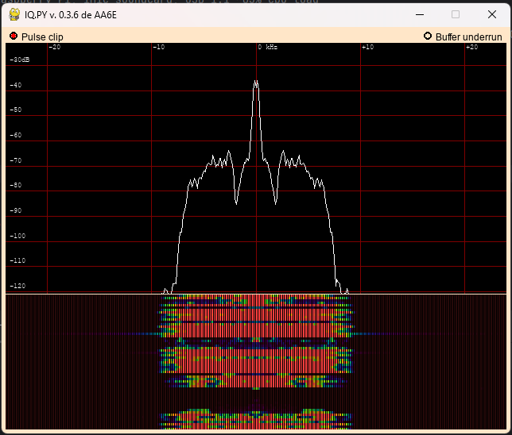

# README
This project was created to allow a PAN adapter to be connected to IQ signals or to a SDR.



## Configuration
- Review ```try.sh``` to see standard scripts that will launch the application.

## Command Help Content
The following are the options that can be provided to the script in order to get the view providing the correct display for operating.
```
Options:
  -h, --help            show this help message and exit
  --FULLSCREEN          Switch to full screen display.
  --HAMLIB              use Hamlib to monitor/control rig frequency.
  --LAGFIX              Special mode to fix PCM290x R/L offset.
  --LCD4                Use 4" LCD instead of large screen
  --RTL                 Set source to RTL-SDR
  --SI570               Set freq control to Si570, not RTL or Hamlib
  --REV                 Reverse I & Q to reverse spectrum display
  --WATERFALL           Use waterfall display.
  --cpu_load_intvl=CPU_LOAD_INTERVAL
                        Seconds delay between CPU load calculations
  --rate=SAMPLE_RATE    sample rate (Hz), eg 48000, 96000, or 1024000 or
                        2048000 (for rtl)
  --hamlib_device=HAMLIB_DEVICE
                        Hamlib serial port.  Default /dev/ttyUSB0.
  --hamlib_intvl=HAMLIB_INTERVAL
                        Seconds delay between Hamlib operations
  --hamlib_rig=HAMLIB_RIGTYPE
                        Hamlib rig type (int).  Run 'rigctl --list' for
                        possibilities.  Default is 229 (Elecraft K3/KX3).
  --index=INDEX         index of audio input card. Use pa.py to examine
                        choices.  Index -1 selects default input device.
  --lcd4_brightness=LCD4_BRIGHTNESS
                        LCD4 display brightness 0 - 100
  --n_buffers=BUFFERS   Number of FFT buffers in 'chunk', default 12
  --pulse_clip=PULSE    pulse clipping threshold, default 10.
  --rtl_freq=RTL_FREQUENCY
                        Initial RTL operating frequency (float kHz)
  --rtl_gain=RTL_GAIN   RTL_SDR gain, default 0.
  --si570_frequency=SI570_FREQUENCY
                        Si570 LO initial frequency, (float kHz)
  --size=SIZE           size of FFT.  Default is 512.
  --skip=SKIP           Skipping input data parameter >= 0
  --sp_min=SP_MIN       spectrum level, low end, dB
  --sp_max=SP_MAX       spectrum level, hi end, dB
  --v_min=V_MIN         palette level, low end, dB
  --v_max=V_MAX         palette level, hi end, dB
  --waterfall_acc=WATERFALL_ACCUMULATION
                        No. of spectra per waterfall line
  --waterfall_palette=WATERFALL_PALETTE
                        Waterfall color palette (1 or 2)
  --disable_onscreen_help
                        Disable onscreen help
  --list_rigs           List available Rigs
  --search_rigs=SEARCH_RIGS
                        Rigs search string
```

## Version History
Cloned from SourceForge and converted to Python3 (only tested with Python 3.62 on Linux mint with rtl_sdr dongle only.

Graynerd June 3, 2018

Tiny Python Panadapter (QST, April, 2014)
Martin Ewing AA6E
Revised May 20, 2014

RELEASE NOTES

June 9, 2014
Version 0.3.6

This version contains support for radios using the Si570 DDS chip as VFO.  For example, in various
SoftRock radios, like the RxTx Ensemble.  A pure Python USB interface is provided that requires the
libusb-1.0 wrapper from https://pypi.python.org/pypi/libusb1/1.2.0 .

The current edition of the supplementary material for the QST article is now provided in the GIT repository
and in the downloadable zip file in ODT (Open Document Text) and PDF (Portable Document) formats.

May 20, 2014
Version 0.3.0

The enclosed file "TPP_qst_suppl_2014_04a.odt" (with .pdf and .doc versions) is an expanded version of the article printed in QST (April, 2014).  It has been updated, but it is probably not quite current, since the project has continued in development after publication.

To use this version, copy the tinypythonpanadapter-code directory to a convenient location on your computer.  Follow directions in the document above to load or build the required resources for your platform.

The most up-to-date information on the TPP project is to be found on-line:

1. Program files, git repository, and related technical material are permanently stored at SourceForge.net - https://sourceforge.net/projects/tinypythonpanadapter/ .

2. Project news, discussion of user issues is available on a SourceForge mailing list.  You can mail questions to tinypythonpanadaptor-discussion@lists.sourceforge.net . 

For a free subscription, sign up at https://lists.sourceforge.net/lists/listinfo/tinypythonpanadapter-discussion .

3. A "lab notebook" about the TPP project with lots of technical and installation information is provided at http://www.aa6e.net/wiki/Tiny_Python_Panadapter .  

4. Text files (e.g. Python source) in the enclosed zip archive may be in Linux format. They can be read with Microsoft Word or similar software or converted to Windows format using the gedit text editor (available for Linux or Windows at https://wiki.gnome.org/Apps/Gedit).


